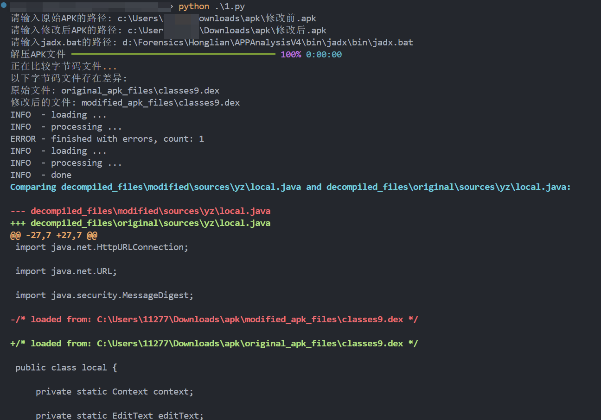

## ✈️ 一、工具特性

- **APK 解压**：将两个 APK 文件解压到指定目录。
- **字节码文件比较**：比较解压目录中的字节码文件（.class 或.dex），通过 SHA-256 哈希值检测文件是否有差异。
- **字节码反编译**：使用 JADX 工具对差异字节码文件进行反编译，以便深入查看代码差异。
- **差异显示**：在控制台中详细显示两个文件之间的代码差异。

## 🚨 二、配置

- Python 3.7 及以上版本
- 必须安装以下 Python 库：
  - `rich`（用于美化控制台输出）
- [JADX](https://github.com/skylot/jadx) 工具（用于反编译字节码）

## 🐉 三、使用

1. **克隆仓库**

   ```bash
   git clone https://github.com/b3nguang/APK-Hash-Comparer.git
   cd APK-Hash-Comparer
   ```

2. **运行脚本**

   在运行脚本时，需要提供原始 APK、修改后 APK 的路径以及 JADX 的路径。可以直接运行以下命令：

   ```bash
   python main.py
   ```

3. **输入路径**

   按照提示输入以下内容：
   - 原始 APK 的路径
   - 修改后 APK 的路径
   - jadx.bat 的路径（JADX 工具的执行文件）

4. **查看结果**

   - 解压 APK 文件后，工具将比较两个 APK 的字节码文件，并列出有差异的文件。
   - 对有差异的文件进行反编译，并在控制台显示反编译后的代码差异。

## 📸 四、示例输出



## ⚠ 五、注意事项

- 确保提供的 APK 文件和 JADX 路径正确，否则脚本将无法正确运行。
- 该工具仅对比字节码文件（.class 和.dex），不比较资源文件。

## 🤝 六、贡献

欢迎贡献代码！如果有任何改进建议或发现问题，欢迎提交 issue 或 pull request。
